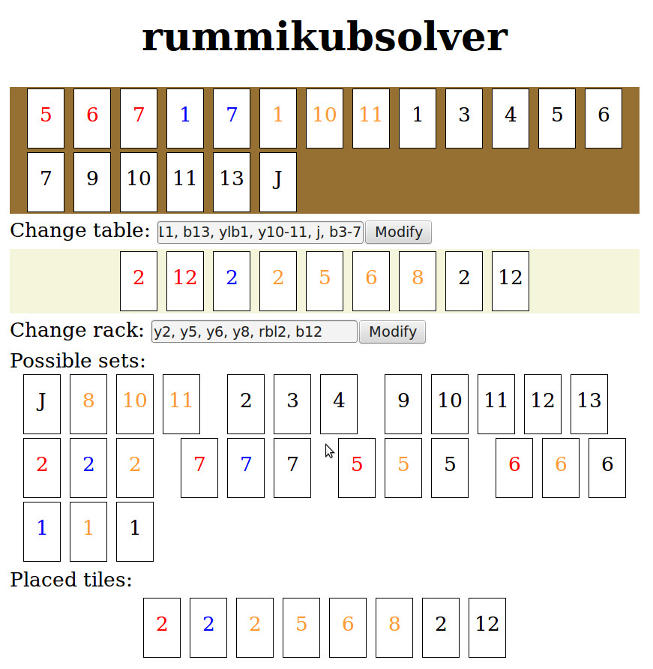

# Rummikub Solver

This is solver for [Rummikub][rummikub] the game.

Don't know whether there is a winning move? Someone can't finish, has made a
mess on board, and can't retrieve original sets? Don't worry! Rummikub Solver
automatically finds the solution.

Rummikub Solver uses integer linear programming to find the solution which
maximizes the number of tiles placed on the table from the rack. You just need
to provide current description of the state of the game. rummikubsolver will
display possible sets that are achievable and tiles that may be placed to
achieve them.

## Installation

### Building from Source

Rummikub Solver requires [GLPK](https://www.gnu.org/software/glpk/). Here are
package pointers to some selected platforms:

- On Ubuntu, with [libglpk-dev](https://packages.ubuntu.com/lunar/libglpk-dev).
- On MacOS, with [Homebrew GLPK](https://formulae.brew.sh/formula/glpk).

Rummikub Solver uses Stack to build & install the package:

```bash
stack build
# installs rummikubsolver
stack install
```

## Usage

Rummikub Solver has 2 UIs available: CLI and GUI. GUI is turned on by default
and uses threepenny-gui to run a web interface. Visit `127.0.0.1:8080` to use
the GUI.

You can run Rummikub Solver after installation by executing `rummikubsolver`.

Both interfaces use special syntax for add or removing tiles from the table or
the rack. For example:

```plaintext
-lr1-3 // Remove (-) blue (l) and red (r) tiles of value from 1 to 3.
y10 // Add a yellow (y) 10 tile
j // Add a joker (j)
-j, b2 // Remove a joker (j) and add black (b) 2.
```

Formally the queries have following syntax:

```plaintext
QUERY ::= [-] (COLOR+ (VALUE | VALUE_RANGE) | j)
COLOR ::= [rlyb]
VALUE ::= 1-13
VALUE_RANGE ::= VALUE - VALUE
```

## Screenshot



## Final remarks

This program was done to train my Rummikub skills and as a helping tool for
board game nights.

[rummikub]: https://en.wikipedia.org/wiki/Rummikub
